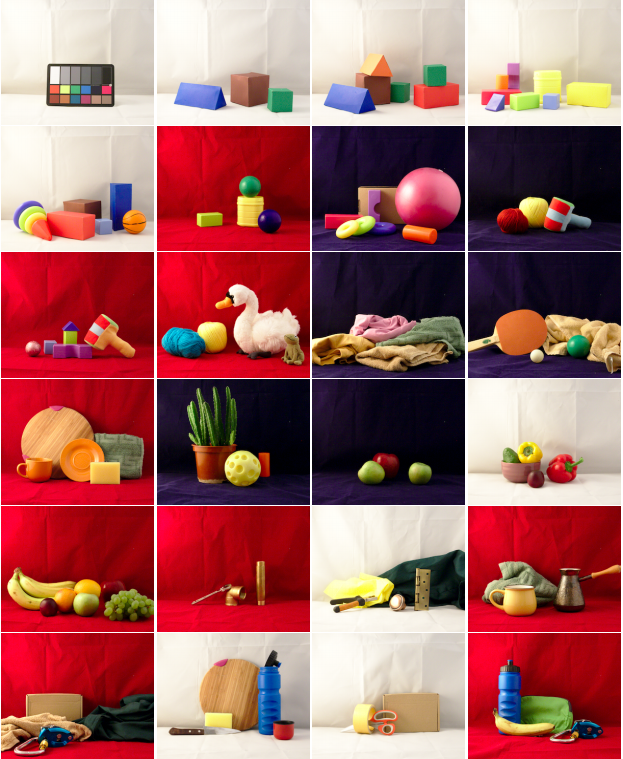
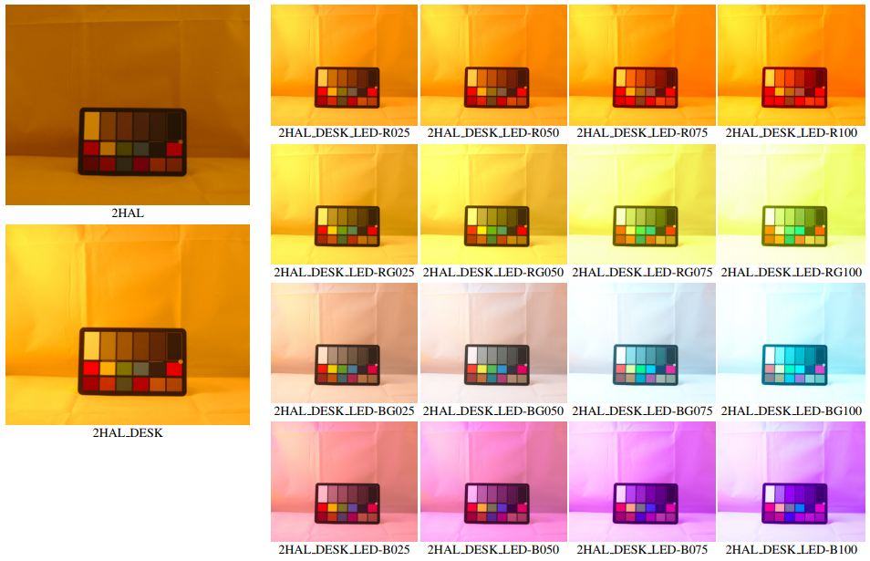

# Multiple Light Source Dataset for Colour Research 

+ Images of **24 multiple object scenes**.
+ Each scene is taken under **18 multiple light source illumination scenarios**, the illuminants are varying in dominant spectral colours, intensity and distance from the scene.
+ **Spectral characteristics** of the camera, illuminants sources and uniformly coloured object surfaces.
+ Pixel-by-pixel masks of uniformly coloured object surfaces for each scene.

We mainly address the realistic scenarios for evaluation of computational colour constancy algorithms, but also have aimed to make the data as general as possible for computational colour science and computer vision. 
Details have been published in: [Multiple Light Source Dataset for Colour Research](https://arxiv.org/abs/1908.06126).

If you use this dataset, please, cite the appropriate paper.

    @article{smagina2019multiple,
    title={Multiple Light Source Dataset for Colour Research},
    author={Smagina, Anna and Ershov, Egor and Grigoryev, Anton},
    journal={arXiv preprint:1908.06126},
    year={2019}
    }

## Image data

 

An overview of all 24 recorded MLS scenes is given on the figure above.

Each scene was constructed inside a 60x60x60 cm softbox and illuminated from the outside.
Illumination of each scene is varied in 18 configurations:

Each image of the scene is marked with a list of the turned-on light sources, which are ones of the following:

+ 2HAL are two halogen lights, installed at the distance about 1.2 m each; form the lighting close to embient, 
+ DESK is a desktop lamp installed at 20 cm from the softbox, 
+ LED-R025, LED-R050, LED-RG025, LED-BG025 etc is a 3-colored (red, green, blue) LED strip mounted at the top of softbox; the letters R, RG, GB or B indicates turned-on colored components of the LED-lapm, while the numbers 025, 050, 070 and 100 indicates the percentage of the emitting power.

The shooting was performed with the white balance adjusted to 6500K. 
No additional white balance correction was performed during the post-processing of the images.

Each scene is also provided with the pixel-by-pixel colouring annotation given in a 8-bit PNG file, in which
unique pixels colour corresponds to uniform colouring of the scene presented in a spectral data (see section below). 

**Full resolution (2314 x 1900)**

[16-bit raw images](https://bit.ly/2lSFbvb) `ftp://vis.iitp.ru/mls-dataset/images_16bit_raw.zip` 19.2 GB

[masks](https://bit.ly/2kLs7aD) `ftp://vis.iitp.ru/mls-dataset/masks_16bit_raw.zip` 4 MB

**Half-resolution (1157 x 950)**

[16-bit lossless compressed png images](https://bit.ly/2kCfyP0) `ftp://vis.iitp.ru/mls-dataset/images_16bit_png.zip` 2.4 GB

[masks](https://bit.ly/2lXwQ9e) `ftp://vis.iitp.ru/mls-dataset/masks_16bit_png.zip` < 1 MB

**Quarter resolution (578 x 475) for preview**

[jpeg images](https://bit.ly/2LSqC6j) `ftp://vis.iitp.ru/mls-dataset/images_preview.zip` 170 MB

[masks](https://bit.ly/2YwJnhH) `ftp://vis.iitp.ru/mls-dataset/masks_preview.zip` < 1MB

Images files are organized as following:

<pre>
├── 01
│   ├── 01_2HAL_DESK_LED-B025.{tif, png, jpg}
│   ├── 01_2HAL_DESK_LED-B050.{tif, png, jpg}
│   ├── 01_2HAL_DESK_LED-B075.{tif, png, jpg}
│   ├── 01_2HAL_DESK_LED-B100.{tif, png, jpg}
│   ├── 01_2HAL_DESK_LED-BG025.{tif, png, jpg}
│   ├── ...
│   ├── 01_2HAL_DESK.{tif, png, jpg}
│   └── 01_2HAL.{tif, png, jpg}
├── 02
│   ...
├── 03
│   ...
</pre>

where the subdirectory name and the first number in the file name — 01, 02, 03 etc — indicates scene number, while the other part of file name — 2HAL, 2HAL_DESK, 2HAL_DESK_LED-B025 etc — is a list of turned on illuminants (see description above in this section).  

Masks files are named as <*scene_number*>.png.

## Camera spectral sensitivity

The shooting was performed on Canon 5D Mark III, the spectral for which was measured by Baek et al. in 
[Compact Single-Shot Hyperspectral Imaging Using a Prism. SH Baek, I Kim, D Gutierrez, MH Kim
ACM Transactions on Graphics, 2017](https://www.researchgate.net/profile/Min_Kim48/publication/321232127_Compact_single-shot_hyperspectral_imaging_using_a_prism/links/5c1815574585157ac1ca090a/Compact-single-shot-hyperspectral-imaging-using-a-prism.pdf).

We also provide camera spectral data in csv-format extracted from the paper above with [Web Plot Digitizer](https://automeris.io/WebPlotDigitizer/citation.html)

[camera spectral sensitivities](https://bit.ly/3629emK) `ftp://vis.iitp.ru/mls-dataset/Canon5DMarkIII_spectralSensitivity.csv` < 1 MB

## Spectra

[illuminants](https://bit.ly/315t0dy) `ftp://vis.iitp.ru/mls-dataset/illuminants.zip` 4 MB

[surfaces](https://bit.ly/2YfcPh0) `ftp://vis.iitp.ru/mls-dataset/surfaces.zip` < 1 MB

[spectra measurement photo](https://bit.ly/2Krv5eE) `ftp://vis.iitp.ru/mls-dataset/spectra_measurement_photo_examples.zip` 2 MB

Illuminants and surfaces spectra are given in the range from 380 nm to 780 nm with sampling every 0.6-0.7 nm. 

Each illuminant and each surface has a unique name, by which the csv-file with the assotiated spectrum is named, e.g. `<surface name>.csv`.
The file with the spectrum contains two columns: "wavelength" and "value".

The illuminants spectra are provided along with the experimental setup scheme and the photo.
All source spectra are measured through the light box, to characterize the real spectra illuminating the objects. 
Also, the spectrum of both halogen lamps measured near the camera lens to get some imformation on relative spectral intensities. 
Note, that spectra of red, green and blue lights of 3-colored LED strip are additive. 

The reflectance spectra were measured relative to the polytetrafluoroethylene standard (please, see [paper](https://arxiv.org/abs/1908.06126) for the details)
With the surface spectra we also provide a correspodence between scene masks and the surfaces names in `mask_to_surface.csv` file.
By default, for each surface we provide a reflectance spectrum, measured at an angle 45 degrees. 
For metallic surfaces we also measured reftance spectrum at 90 degrees, which is given in additional file named `<surface name>.specular.csv`

## Contribution

Contributions (bug reports, bug fixes, improvements, etc.) are very welcome and should be submitted in the form of new issues and/or pull requests on GitHub.

## License & citation  

Copyright 2018 Visillect Service LLC
Developed for Kharkevich Institute for Information Transmission Problems of the Russian Academy of Sciences (IITP RAS)

 Licensed under a <a rel="license" href="http://creativecommons.org/licenses/by-sa/4.0/">Creative Commons Attribution-ShareAlike 4.0 International License</a>
